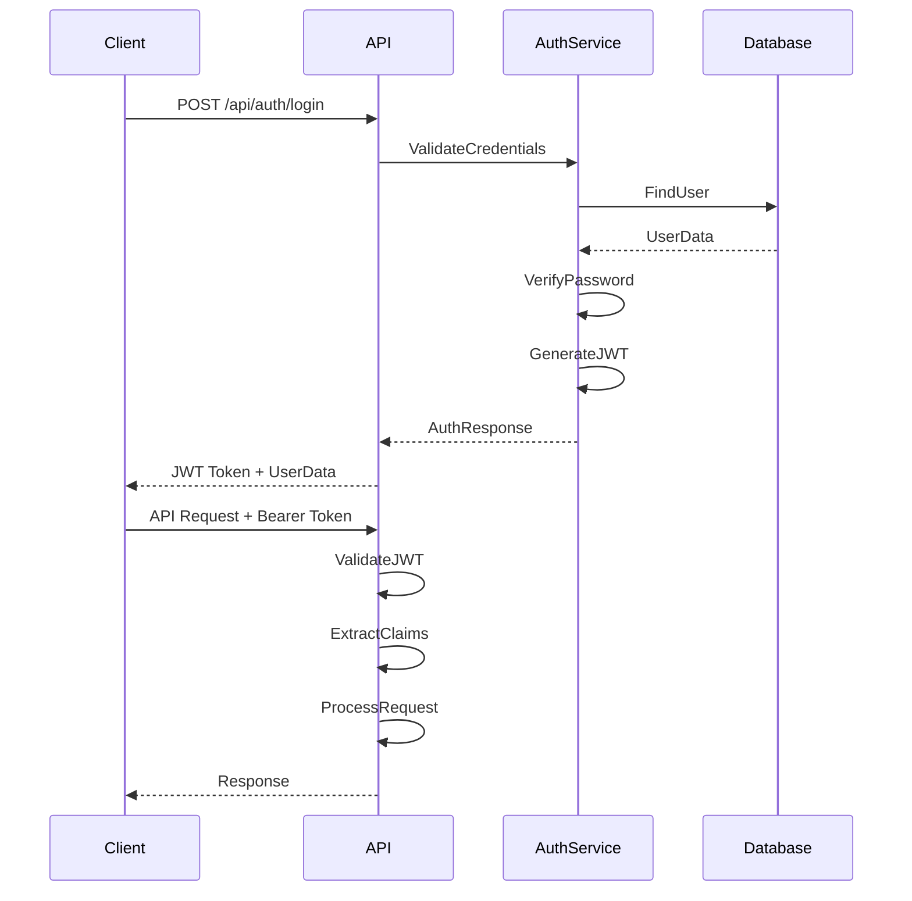

# ERP Training Management System - Technical Documentation

## Table of Contents

1. [System Architecture](#system-architecture)
2. [Technology Stack](#technology-stack)
3. [Database Design](#database-design)
4. [Security Implementation](#security-implementation)
5. [API Design Patterns](#api-design-patterns)
6. [Frontend Architecture](#frontend-architecture)
7. [Development Guidelines](#development-guidelines)
8. [Deployment Guide](#deployment-guide)
9. [Performance Optimization](#performance-optimization)
10. [Testing Strategy](#testing-strategy)

---

## System Architecture

### High-Level Architecture

The ERP Training Management System follows a modern three-tier architecture:

```
┌─────────────────────┐
│   Frontend (React)  │  ← Presentation Layer
├─────────────────────┤
│  API (.NET Core)    │  ← Business Logic Layer
├─────────────────────┤
│  Database (SQL)     │  ← Data Access Layer
└─────────────────────┘
```

### Component Overview

#### Frontend Layer
- **Technology**: React 18 with TypeScript
- **Bundler**: Vite for fast development and builds
- **Styling**: Tailwind CSS for responsive design
- **State Management**: React hooks and context
- **HTTP Client**: Axios for API communication

#### API Layer
- **Framework**: ASP.NET Core 8.0
- **Architecture**: Clean Architecture principles
- **ORM**: Entity Framework Core 9.0
- **Authentication**: JWT Bearer tokens
- **Documentation**: Swagger/OpenAPI 3.0

#### Data Layer
- **Database**: SQL Server
- **Migrations**: Entity Framework migrations
- **Seeding**: Automated data seeding
- **Relationships**: Comprehensive foreign key constraints

---

## Technology Stack

### Backend Technologies

| Component | Technology | Version | Purpose |
|-----------|------------|---------|---------|
| Runtime | .NET Core | 8.0 | Application framework |
| Web Framework | ASP.NET Core | 8.0 | Web API development |
| ORM | Entity Framework Core | 9.0 | Data access and mapping |
| Database | SQL Server | 2019+ | Data persistence |
| Authentication | JWT | 8.13.0 | Secure authentication |
| Password Hashing | BCrypt | 4.0.3 | Secure password storage |
| Object Mapping | AutoMapper | 12.0.1 | DTO mapping |
| Documentation | Swashbuckle | 6.4.0 | API documentation |

### Frontend Technologies

| Component | Technology | Version | Purpose |
|-----------|------------|---------|---------|
| Framework | React | 18+ | UI development |
| Language | TypeScript | 5+ | Type-safe development |
| Build Tool | Vite | 5+ | Fast development builds |
| Styling | Tailwind CSS | 3+ | Utility-first CSS |
| HTTP Client | Axios | 1+ | API communication |
| Routing | React Router | 6+ | Client-side routing |

### Development Tools

| Tool | Purpose |
|------|---------|
| Visual Studio Code | Primary IDE |
| Git | Version control |
| npm/yarn | Package management |
| ESLint | Code linting |
| Prettier | Code formatting |
| Postman | API testing |

---

## Database Design

### Entity Relationship Diagram

```
Users ────────┐
              │
              ├─── UserModuleProgress
              │
              └─── UserLessonProgress
                   │
Modules ───────────┼─── Sections
   │               │
   └─── Assessments ─── Questions
                    │
                    └─── UserAnswers
```

### Core Entities

#### Users Table
```sql
CREATE TABLE Users (
    Id NVARCHAR(450) PRIMARY KEY,
    FirstName NVARCHAR(MAX),
    LastName NVARCHAR(MAX),
    Email NVARCHAR(256),
    Department NVARCHAR(MAX),
    IsActive BIT,
    JoinDate DATETIME2,
    Avatar NVARCHAR(MAX),
    CreatedAt DATETIME2,
    UpdatedAt DATETIME2
);
```

#### Modules Table
```sql
CREATE TABLE Modules (
    Id INT IDENTITY(1,1) PRIMARY KEY,
    Title NVARCHAR(MAX),
    Description NVARCHAR(MAX),
    EstimatedDuration NVARCHAR(MAX),
    DifficultyLevel NVARCHAR(MAX),
    LearningObjectives NVARCHAR(MAX), -- JSON array
    Prerequisites NVARCHAR(MAX),      -- JSON array
    IsActive BIT,
    CreatedAt DATETIME2,
    UpdatedAt DATETIME2
);
```

#### Sections Table
```sql
CREATE TABLE Sections (
    Id INT IDENTITY(1,1) PRIMARY KEY,
    ModuleId INT,
    Title NVARCHAR(MAX),
    Description NVARCHAR(MAX),
    [Order] INT,
    Content NVARCHAR(MAX),
    ErpSectionId NVARCHAR(MAX),
    IsActive BIT,
    CreatedAt DATETIME2,
    UpdatedAt DATETIME2,
    FOREIGN KEY (ModuleId) REFERENCES Modules(Id)
);
```

### Data Seeding Strategy

The system uses a comprehensive seeding strategy:

1. **Role Seeding**: Create default roles (Admin, Instructor, Student)
2. **User Seeding**: Create default admin and test users
3. **Module Seeding**: Load 12 comprehensive training modules
4. **Section Seeding**: Load 626 sections across all modules
5. **Assessment Seeding**: Create sample assessments and questions

### Module-Section Mapping

| Module ID | Module Title | Section Count | JSON File |
|-----------|--------------|---------------|-----------|
| 1 | Data Models & Security | 52 | module-1-sections.json |
| 2 | SAP Basics & ERP Fundamentals | 48 | module-2-sections.json |
| 3 | Order to Cash Process | 45 | module-3-sections.json |
| 4 | Production Planning & Material Management | 50 | module-4-sections.json |
| 5 | Finance & Controlling | 49 | module-5-sections.json |
| 6 | Sales & Distribution | 51 | module-6-sections.json |
| 8 | Project Management & Resource Planning | 45 | module-8-sections.json |
| 9 | Workflow & Business Process Management | 42 | module-9-sections.json |
| 10 | Integration & System Management | 48 | module-10-sections.json |
| 11 | Mobile Solutions & Cloud Integration | 47 | module-11-sections.json |
| 12 | Analytics & Business Intelligence | 49 | module-12-sections.json |
| 15 | Training Management & Learning Analytics | 50 | module-15-sections.json |

---

## Security Implementation

### Authentication Flow



### JWT Token Structure

```json
{
  "header": {
    "alg": "HS256",
    "typ": "JWT"
  },
  "payload": {
    "sub": "user-id",
    "email": "user@example.com",
    "role": "User",
    "iat": 1627846261,
    "exp": 1627932661
  }
}
```

### Authorization Levels

| Role | Permissions |
|------|-------------|
| **Admin** | Full system access, user management, content creation |
| **Instructor** | Module management, assessment creation, progress viewing |
| **Student** | Module access, assessment taking, progress tracking |

### Security Measures

1. **Password Security**
   - BCrypt hashing with salt
   - Minimum complexity requirements
   - Rate limiting on login attempts

2. **API Security**
   - JWT token validation
   - CORS configuration
   - Input validation and sanitization
   - SQL injection prevention

3. **Data Protection**
   - Encrypted sensitive data
   - Audit logging
   - Access control lists
   - GDPR compliance considerations

---

## API Design Patterns

### RESTful Principles

The API follows REST principles with consistent patterns:

- **Resources**: Nouns in URLs (`/api/modules`, `/api/sections`)
- **HTTP Methods**: Standard verbs (GET, POST, PUT, DELETE)
- **Status Codes**: Appropriate HTTP status codes
- **Stateless**: No server-side session state

### Response Patterns

#### Success Response
```json
{
  "success": true,
  "message": "Operation completed successfully",
  "data": { /* response data */ }
}
```

#### Error Response
```json
{
  "success": false,
  "message": "Operation failed",
  "errors": ["Specific error messages"]
}
```

#### Pagination Response
```json
{
  "success": true,
  "message": "Data retrieved successfully",
  "data": [ /* items */ ],
  "pagination": {
    "totalCount": 150,
    "pageNumber": 1,
    "pageSize": 20,
    "totalPages": 8
  }
}
```

### Error Handling Strategy

1. **Global Exception Handler**
   - Catches unhandled exceptions
   - Returns consistent error format
   - Logs errors for debugging

2. **Validation Errors**
   - Model validation attributes
   - Custom validation logic
   - Detailed error messages

3. **Business Logic Errors**
   - Custom exception types
   - Meaningful error messages
   - Appropriate HTTP status codes

---

## Frontend Architecture

### Component Structure

```
src/
├── components/           # Reusable UI components
│   ├── Layout/          # Layout components
│   ├── Forms/           # Form components
│   └── Common/          # Common UI elements
├── pages/               # Page components
│   ├── Auth/            # Authentication pages
│   ├── Modules/         # Module-related pages
│   └── Assessments/     # Assessment pages
├── api/                 # API communication
├── types/               # TypeScript type definitions
├── utils/               # Utility functions
└── styles/              # Global styles
```

### State Management

The application uses React's built-in state management:

1. **Local State**: `useState` for component-specific state
2. **Context API**: For global state (authentication, theme)
3. **Custom Hooks**: For reusable stateful logic

### TypeScript Integration

Full TypeScript support with:

- Strict type checking
- Interface definitions for all data models
- Generic type utilities
- Type-safe API calls

---

## Development Guidelines

### Code Style

#### Backend (.NET)
- Follow Microsoft C# coding conventions
- Use async/await for asynchronous operations
- Implement proper error handling
- Use dependency injection

#### Frontend (React/TypeScript)
- Follow React best practices
- Use functional components with hooks
- Implement proper TypeScript typing
- Use ESLint and Prettier for consistency

### Naming Conventions

#### Database
- Tables: PascalCase (e.g., `Users`, `Modules`)
- Columns: PascalCase (e.g., `FirstName`, `CreatedAt`)
- Foreign Keys: Reference table + Id (e.g., `ModuleId`)

#### API
- Controllers: PascalCase + Controller (e.g., `ModulesController`)
- Actions: PascalCase (e.g., `GetAllModules`)
- DTOs: PascalCase + Dto (e.g., `ModuleDto`)

#### Frontend
- Components: PascalCase (e.g., `ModuleCard`)
- Files: PascalCase for components, camelCase for utilities
- Props/State: camelCase

### Git Workflow

1. **Feature Branches**: Create feature branches from main
2. **Commits**: Use conventional commit messages
3. **Pull Requests**: Require code review before merging
4. **Main Branch**: Always keep main branch deployable

---

## Deployment Guide

### Prerequisites

- .NET 8.0 SDK
- SQL Server 2019+
- Node.js 18+
- IIS or similar web server

### Backend Deployment

1. **Build Application**
   ```bash
   dotnet publish -c Release -o ./publish
   ```

2. **Database Setup**
   ```bash
   dotnet ef database update
   ```

3. **Environment Configuration**
   ```json
   {
     "ConnectionStrings": {
       "DefaultConnection": "Production connection string"
     },
     "Jwt": {
       "Key": "Production secret key",
       "Issuer": "Production issuer"
     }
   }
   ```

### Frontend Deployment

1. **Build Application**
   ```bash
   npm run build
   ```

2. **Static File Hosting**
   - Deploy `dist` folder to web server
   - Configure routes for SPA
   - Set up HTTPS

### Environment Configurations

#### Development
- Local SQL Server database
- Hot reload enabled
- Detailed error messages
- Swagger UI enabled

#### Production
- Production database
- Error logging
- Security headers
- Performance optimization

---

## Performance Optimization

### Backend Optimizations

1. **Database**
   - Proper indexing on frequently queried columns
   - Efficient query patterns
   - Connection pooling
   - Lazy loading where appropriate

2. **API**
   - Response caching
   - Compression middleware
   - Asynchronous operations
   - Pagination for large datasets

3. **Memory Management**
   - Proper disposal of resources
   - Memory profiling
   - Garbage collection optimization

### Frontend Optimizations

1. **Bundle Optimization**
   - Code splitting
   - Lazy loading of routes
   - Tree shaking
   - Asset optimization

2. **Runtime Performance**
   - React.memo for expensive components
   - Efficient re-rendering patterns
   - Virtualization for large lists
   - Image optimization

3. **Caching Strategy**
   - HTTP caching
   - Service worker caching
   - Local storage for user preferences

---

## Testing Strategy

### Backend Testing

#### Unit Tests
- Service layer testing
- Repository pattern testing
- Business logic validation
- Mock external dependencies

#### Integration Tests
- API endpoint testing
- Database integration testing
- Authentication flow testing
- End-to-end scenarios

#### Test Structure
```csharp
[TestClass]
public class ModuleServiceTests
{
    private IModuleService _moduleService;
    private Mock<IModuleRepository> _mockRepository;
    
    [TestInitialize]
    public void Setup()
    {
        _mockRepository = new Mock<IModuleRepository>();
        _moduleService = new ModuleService(_mockRepository.Object);
    }
    
    [TestMethod]
    public async Task GetModuleById_ValidId_ReturnsModule()
    {
        // Arrange
        // Act
        // Assert
    }
}
```

### Frontend Testing

#### Component Tests
- React Testing Library
- Jest for test runner
- Mock API responses
- User interaction testing

#### E2E Tests
- Cypress for end-to-end testing
- Critical user journeys
- Cross-browser testing
- Performance testing

---

## Maintenance and Monitoring

### Logging Strategy

1. **Application Logs**
   - Structured logging with Serilog
   - Log levels: Debug, Info, Warning, Error, Critical
   - Request/response logging
   - Performance metrics

2. **Error Tracking**
   - Global exception handling
   - Error aggregation and analysis
   - Alerting for critical errors
   - Stack trace collection

### Health Monitoring

1. **Health Checks**
   - Database connectivity
   - External service dependencies
   - Application health endpoints
   - Performance metrics

2. **Metrics Collection**
   - API response times
   - Database query performance
   - User activity tracking
   - System resource usage

---

## Future Enhancements

### Planned Features

1. **Advanced Analytics**
   - Learning analytics dashboard
   - Progress visualization
   - Performance recommendations
   - Predictive modeling

2. **Mobile Application**
   - React Native mobile app
   - Offline learning capability
   - Push notifications
   - Mobile-optimized content

3. **Integration Capabilities**
   - LMS integration
   - SCORM compliance
   - Single sign-on (SSO)
   - Third-party content providers

4. **Advanced Assessment**
   - Adaptive questioning
   - Multimedia assessments
   - Peer review systems
   - Certification tracking

---

*Document Version: 1.0*
*Last Updated: July 30, 2025*
*Author: ERP Training Development Team*
